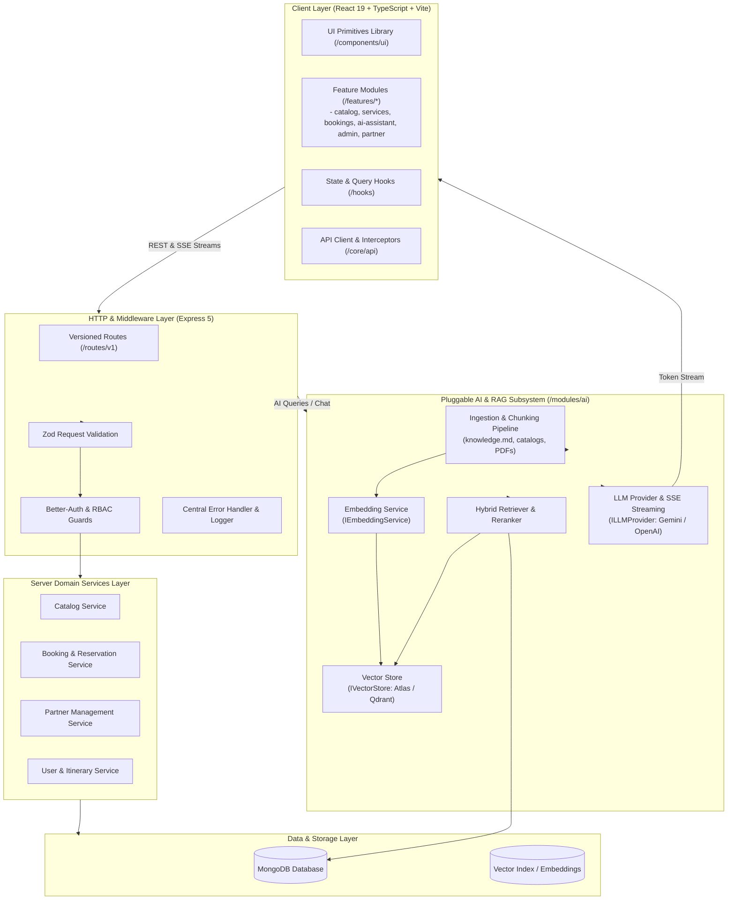
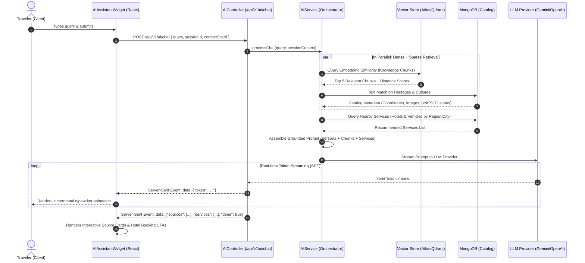
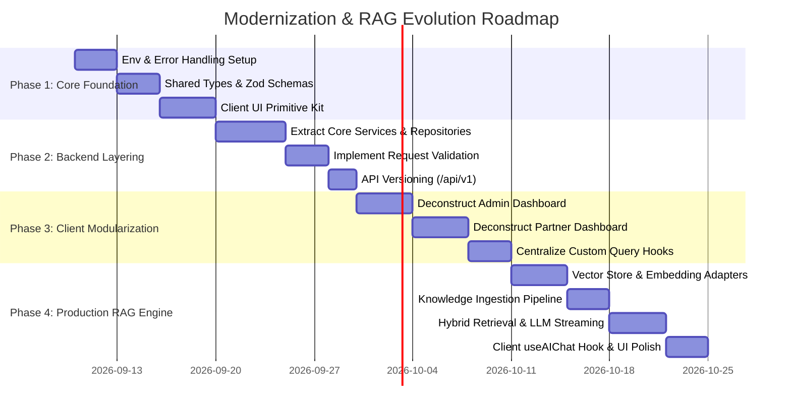

# TravelAssist: System Architecture & Code Quality Blueprint

**Document Version:** 1.0.0  
**Status:** Approved Architectural Specification  
**Scope:** Client (React 19 + Vite), Server (Node.js + Express 5), and Pluggable AI / RAG Subsystem  

---

## 1. Executive Summary & Core Architectural Principles

TravelAssist is a comprehensive travel guide and service booking platform for Ethiopia. To ensure long-term maintainability, developer velocity, and seamless evolution into an AI-powered travel companion, this document defines the target architectural standard and folder structure.

### Core Architectural Tenets
1. **Separation of Concerns (Clean / Layered Architecture)**:
   - **Controllers** handle HTTP transport only (status codes, headers, parameter extraction).
   - **Services** encapsulate all domain business logic, orchestration, and transactional rules.
   - **Repositories** abstract data access, isolation from ORM/ODM (Mongoose) implementation details.
   - **Models** define data storage contracts and schemas.
2. **Feature-Driven Frontend (Screaming Architecture)**:
   - Domain logic, state hooks, components, and API calls are co-located within dedicated feature modules (`client/src/features/*`), rather than scattered across generic flat directories.
3. **Pluggable AI & RAG Subsystem**:
   - The AI assistant is architected as an independent, interface-driven module (`server/src/modules/ai/`).
   - Abstract interfaces (`IVectorStore`, `IEmbeddingService`, `ILLMProvider`) ensure zero vendor lock-in. Support is built for local development, MongoDB Atlas Vector Search, Pinecone/Qdrant, and multi-model LLM backends (OpenAI, Google Gemini, Anthropic).
4. **End-to-End Type Safety & Runtime Validation**:
   - Strict TypeScript contracts coupled with runtime schema validation (**Zod**) ensure inputs and environment variables are verified before hitting business logic.
5. **Zero-Downtime Phased Evolution**:
   - Architectural refactoring is modular and incremental, preserving existing endpoints and database records without breaking user flows.

---

## 2. Current State vs. Target State Audit

### Current Codebase Pain Points & Technical Debt

| Area | Current Implementation | Target Pattern |
| :--- | :--- | :--- |
| **Client Monoliths** | `PartnerDashboard.tsx` (1,480 lines) and `AdminDashboard.tsx` (1,066 lines) mix UI, forms, state, Leaflet maps, and network requests. | Decompose into feature-specific components (`components/`, `hooks/`, `services/`) with thin routing pages (< 80 lines). |
| **Server Controllers** | `serviceController.ts` (344 lines) and `ragController.ts` (174 lines) directly query Mongoose models with inline error checking. | Pure controllers delegating to domain services (`ServiceService`, `RAGService`) and repositories. |
| **RAG Prototype** | Hardcoded regex keyword matching on MongoDB documents with string concatenation mock responses. | Production Vector RAG: Ingestion pipeline, semantic chunking, vector embedding, hybrid search (dense + BM25), and SSE token streaming. |
| **Validation Layer** | Ad-hoc `if (!field)` checks or letting Mongoose throw 500 runtime errors. | Explicit Zod schemas with centralized validation middleware returning structured 400 Bad Request responses. |
| **Error Handling** | Repetitive `try...catch` blocks returning raw errors to clients: `res.status(500).json({ message: "Server Error", error })`. | Global Error Handling Middleware, standard `AppError` class hierarchy, and uniform API envelopes (`ApiResponse<T>`). |
| **UI Primitives** | Tailwind classes and modal overlays re-implemented redundantly across 15+ pages. | Reusable design system kit under `client/src/components/ui/` (Button, Modal, Input, Badge, Table, etc.). |

---

## 3. High-Level Target System Architecture



---

## 4. Modular Folder Structures

### 4.1 Server Architecture (`/server/src`)

```
server/
├── package.json
├── tsconfig.json
├── .env
├── src/
│   ├── index.ts                      # App entry point, server startup & graceful shutdown
│   ├── app.ts                        # Express instance, global middleware, route mounting
│   │
│   ├── config/                       # Centralized, validated environment configuration
│   │   ├── env.config.ts             # Zod schema validating process.env at startup
│   │   ├── db.config.ts              # MongoDB/Mongoose connection manager
│   │   ├── auth.config.ts            # Better-Auth initialization & configuration
│   │   └── ai.config.ts              # AI model keys, embedding models, vector store config
│   │
│   ├── common/                       # Shared server-wide infrastructure & utilities
│   │   ├── errors/                   # Custom application error classes
│   │   │   ├── AppError.ts           # Base error with HTTP status codes
│   │   │   ├── BadRequestError.ts
│   │   │   ├── UnauthorizedError.ts
│   │   │   ├── ForbiddenError.ts
│   │   │   └── NotFoundError.ts
│   │   ├── middleware/               # Global Express middleware
│   │   │   ├── errorHandler.ts       # Centralized error formatter
│   │   │   ├── validateRequest.ts    # Generic Zod validation middleware
│   │   │   ├── requestLogger.ts      # Structured request/response logging
│   │   │   └── rateLimiter.ts        # Rate limiting protection
│   │   ├── responses/                # Standardized API response helpers
│   │   │   └── ApiResponse.ts        # { success: true, data: T, meta?: any }
│   │   └── utils/                    # Generic utilities (sanitizers, date helpers)
│   │       ├── logger.ts
│   │       └── dateUtils.ts
│   │
│   ├── core/                         # Domain-driven core business modules
│   │   ├── catalog/                  # UNESCO Heritages & Cultural Events
│   │   │   ├── catalog.routes.ts     # Express router definition
│   │   │   ├── catalog.controller.ts # Transport layer handling
│   │   │   ├── catalog.service.ts    # Business logic & validations
│   │   │   ├── catalog.repository.ts # Mongoose data access methods
│   │   │   ├── catalog.validation.ts # Zod request validation schemas
│   │   │   └── models/               # Schemas & Mongoose models
│   │   │       ├── Heritage.ts
│   │   │       └── Culture.ts
│   │   │
│   │   ├── services/                 # Hotels & Vehicle Rentals
│   │   │   ├── services.routes.ts
│   │   │   ├── services.controller.ts
│   │   │   ├── services.service.ts
│   │   │   ├── services.repository.ts
│   │   │   ├── services.validation.ts
│   │   │   └── models/
│   │   │       ├── Hotel.ts
│   │   │       └── Vehicle.ts
│   │   │
│   │   ├── bookings/                 # Reservations & Booking Engine
│   │   │   ├── bookings.routes.ts
│   │   │   ├── bookings.controller.ts
│   │   │   ├── bookings.service.ts   # Date validation, availability, pricing calculation
│   │   │   ├── bookings.repository.ts
│   │   │   ├── bookings.validation.ts
│   │   │   └── models/
│   │   │       └── Booking.ts
│   │   │
│   │   └── user/                     # User profile, favorites & drag-drop itinerary
│   │       ├── user.routes.ts
│   │       ├── user.controller.ts
│   │       ├── user.service.ts
│   │       ├── user.repository.ts
│   │       ├── user.validation.ts
│   │       └── models/
│   │           └── UserTripData.ts
│   │
│   ├── modules/                      # Standalone, pluggable enterprise subsystems
│   │   └── ai/                       # ⭐ PRODUCTION RAG & AI ENGINE
│   │       ├── ai.routes.ts          # /api/v1/ai/query, /api/v1/ai/chat (SSE)
│   │       ├── ai.controller.ts      # HTTP and streaming event handlers
│   │       ├── ai.service.ts         # High-level RAG orchestration
│   │       │
│   │       ├── interfaces/           # Clean architectural contracts
│   │       │   ├── IVectorStore.ts   # Upsert vectors, similarity search
│   │       │   ├── IEmbeddingService.ts # Generate vector embeddings
│   │       │   └── ILLMProvider.ts   # Text completion & token streaming
│   │       │
│   │       ├── providers/            # Swappable third-party implementations
│   │       │   ├── embeddings/
│   │       │   │   ├── GeminiEmbeddingService.ts
│   │       │   │   └── OpenAIEmbeddingService.ts
│   │       │   ├── vector-store/
│   │       │   │   ├── MongoVectorStore.ts (Atlas $vectorSearch)
│   │       │   │   └── QdrantVectorStore.ts
│   │       │   └── llm/
│   │       │       ├── GeminiLLMProvider.ts
│   │       │       └── OpenAILLMProvider.ts
│   │       │
│   │       ├── ingestion/            # Knowledge base document indexer
│   │       │   ├── loaders/          # MarkdownLoader, MongoEntityLoader
│   │       │   ├── chunkers/         # SemanticChunker, RecursiveTextChunker
│   │       │   └── indexer.ts        # Ingestion orchestrator CLI & job
│   │       │
│   │       ├── retrieval/            # Context retrieval & hybrid ranking
│   │       │   ├── hybridRetriever.ts# Dense semantic search + BM25 keyword matching
│   │       │   └── reranker.ts       # Contextual relevance re-ranking
│   │       │
│   │       ├── prompts/              # Versioned system prompts & guardrails
│   │       │   ├── systemPrompt.ts   # Persona, Ethiopian cultural tone, safety guardrails
│   │       │   └── promptBuilder.ts  # Context assembly & token budget optimizer
│   │       │
│   │       └── memory/               # Conversation history management
│   │           ├── ConversationBuffer.ts
│   │           └── models/
│   │               └── ChatSession.ts # Persisted conversation context
│   │
│   ├── scripts/                      # Standalone maintenance, seed, & indexing scripts
│   │   ├── seedHeritages.ts
│   │   ├── seedCultures.ts
│   │   ├── seedServices.ts
│   │   ├── makeAdmin.ts
│   │   └── runKnowledgeIndexer.ts    # Ingests knowledge.md into the Vector DB
│   │
│   └── types/                        # Shared TypeScript ambient definitions & DTOs
│       ├── express.d.ts              # Extended Express Request (with user session)
│       └── common.types.ts
```

---

### 4.2 Client Architecture (`/client/src`)

```
client/
├── package.json
├── vite.config.ts
├── tsconfig.json
├── src/
│   ├── main.tsx                      # Bootstrap: React DOM render & root providers
│   ├── App.tsx                       # High-level declarative routing table
│   ├── index.css                     # Tailwind CSS v4 design tokens & theme layers
│   │
│   ├── core/                         # Core global infrastructure
│   │   ├── api/                      # Central API client & interceptors
│   │   │   ├── client.ts             # Axios / Fetch client with withCredentials: true
│   │   │   └── endpoints.ts          # Central type-safe URL constants
│   │   ├── auth/                     # Better-Auth client & session utilities
│   │   │   ├── auth-client.ts
│   │   │   └── useAuth.ts
│   │   └── router/                   # Route protection wrappers
│   │       ├── ProtectedRoute.tsx    # Requires authenticated user
│   │       ├── AdminRoute.tsx        # Requires role: 'admin'
│   │       └── PartnerRoute.tsx      # Requires role: 'partner' or 'admin'
│   │
│   ├── components/                   # Reusable cross-feature UI kit
│   │   ├── ui/                       # Atomic UI primitives (stateless, pure styling)
│   │   │   ├── Button.tsx
│   │   │   ├── Input.tsx
│   │   │   ├── Modal.tsx
│   │   │   ├── Card.tsx
│   │   │   ├── Badge.tsx
│   │   │   ├── Skeleton.tsx
│   │   │   ├── Tabs.tsx
│   │   │   ├── Table.tsx
│   │   │   └── Dropdown.tsx
│   │   ├── layout/                   # Layout wrappers & global navigation
│   │   │   ├── Navbar.tsx
│   │   │   ├── Footer.tsx
│   │   │   ├── Layout.tsx
│   │   │   └── PartnerNavbar.tsx
│   │   ├── feedback/                 # Notification banners, loaders, error boundaries
│   │   │   ├── ToastContext.tsx
│   │   │   └── ErrorBoundary.tsx
│   │   └── widgets/                  # Standalone interactive travel widgets
│   │       ├── MapWidget.tsx         # Leaflet interactive map
│   │       └── WeatherWidget.tsx     # Destination weather & forecasts
│   │
│   ├── features/                     # Feature-sliced domain modules
│   │   ├── catalog/                  # Heritages & Cultural Events
│   │   │   ├── components/           # HeritageCard, CultureCard, CatalogFilterBar
│   │   │   ├── hooks/                # useHeritages, useCultures, useCatalogFilters
│   │   │   ├── services/             # catalogApi.ts
│   │   │   └── types/                # catalog.types.ts
│   │   │
│   │   ├── services/                 # Hotels & Vehicle Rentals
│   │   │   ├── components/           # HotelCard, VehicleCard, AmenitiesGrid, PriceTag
│   │   │   ├── hooks/                # useHotels, useVehicles, useServiceFilters
│   │   │   ├── services/             # servicesApi.ts
│   │   │   └── types/                # services.types.ts
│   │   │
│   │   ├── bookings/                 # Reservation modals & checkout flow
│   │   │   ├── components/           # BookingModal, DateRangePicker, GuestSelector
│   │   │   ├── hooks/                # useBookingForm, useCreateBooking
│   │   │   ├── services/             # bookingApi.ts
│   │   │   └── types/                # booking.types.ts
│   │   │
│   │   ├── itinerary/                # Interactive trip planner & drag-drop board
│   │   │   ├── components/           # ItineraryBoard, DayColumn, SortableItem
│   │   │   ├── hooks/                # useItineraryData, useDragDropTimeline
│   │   │   ├── services/             # itineraryApi.ts
│   │   │   └── types/                # itinerary.types.ts
│   │   │
│   │   ├── admin/                    # Decomposed Admin Dashboard feature
│   │   │   ├── components/
│   │   │   │   ├── AdminStatsCards.tsx
│   │   │   │   ├── CatalogDataTable.tsx
│   │   │   │   ├── EntityEditorModal.tsx
│   │   │   │   └── CoordinatesMapPicker.tsx
│   │   │   ├── hooks/                # useAdminCatalog, useAdminMutations
│   │   │   ├── services/             # adminApi.ts
│   │   │   └── types/                # admin.types.ts
│   │   │
│   │   ├── partner/                  # Decomposed Partner Dashboard feature
│   │   │   ├── components/
│   │   │   │   ├── PartnerMetricsCards.tsx
│   │   │   │   ├── PartnerListingsTable.tsx
│   │   │   │   ├── PartnerReservationsTable.tsx
│   │   │   │   └── ListingEditorModal.tsx
│   │   │   ├── hooks/                # usePartnerListings, usePartnerReservations
│   │   │   ├── services/             # partnerApi.ts
│   │   │   └── types/                # partner.types.ts
│   │   │
│   │   └── ai-assistant/             # ⭐ AI / RAG Chat Interface
│   │       ├── components/
│   │       │   ├── AIAssistantWidget.tsx       # Floating toggle button & container
│   │       │   ├── ChatDrawer.tsx              # Animated slide-in modal
│   │       │   ├── MessageList.tsx             # Scrollable message history
│   │       │   ├── MessageBubble.tsx           # Formatted markdown output
│   │       │   ├── SourceCitationCard.tsx      # Clickable destination previews
│   │       │   ├── ServiceRecommendation.tsx   # Recommended hotels / vehicles
│   │       │   └── PromptSuggestions.tsx       # Starter chips
│   │       ├── hooks/
│   │       │   ├── useAIChat.ts                # Handles SSE streaming & message state
│   │       │   └── useChatScroll.ts
│   │       ├── services/
│   │       │   └── aiApi.ts                    # SSE fetch and streaming reader
│   │       └── types/
│   │           └── ai.types.ts
│   │
│   ├── shared/                       # Shared helpers, hooks, and constants
│   │   ├── hooks/                    # useDebounce, useLocalStorage, useMediaQuery
│   │   ├── utils/                    # currencyFormatter, distanceCalculator
│   │   └── constants/                # ethiopiaRegions, unescoCategories
│   │
│   └── pages/                        # Thin routing entry points (< 80 lines each)
│       ├── Home.tsx                  # Landing page
│       ├── Explore.tsx               # Renders <CatalogExplorer />
│       ├── HeritageDetail.tsx        # Renders <HeritageDetailView id={id} />
│       ├── CultureDetail.tsx         # Renders <CultureDetailView id={id} />
│       ├── Services.tsx              # Renders <ServicesExplorer />
│       ├── HotelDetail.tsx           # Renders <HotelDetailView id={id} />
│       ├── VehicleDetail.tsx         # Renders <VehicleDetailView id={id} />
│       ├── MyTrips.tsx               # Renders <ItineraryBoard />
│       ├── Essentials.tsx            # Renders <TouristEssentialsView />
│       ├── TransportInfo.tsx         # Renders <TransportInfoView />
│       ├── AdminDashboard.tsx        # Thin page rendering <AdminDashboardView />
│       ├── PartnerLanding.tsx        # Partner acquisition page
│       ├── PartnerDashboard.tsx      # Thin page rendering <PartnerDashboardView />
│       ├── Login.tsx                 # Auth entry
│       └── Signup.tsx                # Auth registration
```

---

## 5. Detailed Design: Production RAG & AI Subsystem

The RAG subsystem enables travelers to ask natural language questions (e.g., *"What is the best itinerary for 3 days in Gondar including castles and nearby boutique hotels?"*) and receive accurate, grounded answers synthesized with live catalog links and booking recommendations.



### 5.1 Ingestion & Chunking Pipeline
1. **Document Sources**:
   - `server/src/knowledge.md` (UNESCO descriptions, historical timelines, practical logistics).
   - `server/src/knowledge_culture.md` (Cultural festivals, coffee ceremony, ethnic traditions).
   - Active database records (`Heritage`, `Culture`, `Hotel`, `Vehicle`).
2. **Chunking Strategy**:
   - **Chunk Size**: 600 tokens with 100-token overlap using `RecursiveCharacterChunker`.
   - **Enriched Metadata**: Every chunk includes `{ docId, title, region, category, isUnesco, sourceFile, entityType }`.
3. **Embeddings**:
   - Standardized `IEmbeddingService` interface.
   - Recommended model: Google `text-embedding-004` (768 dimensions) or OpenAI `text-embedding-3-small` (1536 dimensions).

### 5.2 Vector Store Abstraction (`IVectorStore`)

```typescript
export interface VectorSearchResult {
  id: string;
  text: string;
  metadata: Record<string, any>;
  score: number;
}

export interface IVectorStore {
  initialize(): Promise<void>;
  upsert(vectors: Array<{ id: string; values: number[]; metadata: Record<string, any>; text: string }>): Promise<void>;
  similaritySearch(queryVector: number[], topK: number, filter?: Record<string, any>): Promise<VectorSearchResult[]>;
  delete(ids: string[]): Promise<void>;
}
```

*Implementation Options*:
- **MongoDB Atlas Vector Search (`MongoVectorStore`)**: Zero additional infrastructure; utilizes MongoDB's native `$vectorSearch` aggregation stage on the existing database cluster.
- **Qdrant / Pinecone (`QdrantVectorStore`)**: Dedicated vector databases for high-concurrency production deployments.

### 5.3 Hybrid Retrieval & Re-Ranking
- **Dense Vector Search**: Captures semantic intent (e.g., *"peaceful mountain hiking"* matches *Simien Mountains National Park* even without keyword overlap).
- **Sparse / Exact Match**: Queries MongoDB for exact city or site names (`Lalibela`, `Fasil Ghebbi`).
- **Context Synthesis**: Merges top-ranked knowledge chunks with real-time hotel/vehicle records from MongoDB.

### 5.4 Streaming API & Client Consumption
- **Endpoint**: `POST /api/v1/ai/chat` using `text/event-stream` (Server-Sent Events).
- **Client Hook (`useAIChat`)**: Reads the stream using `fetch()` and `ReadableStreamDefaultReader`, updating React state per token without re-rendering the full message list.

---

## 6. Design System & Component Modularization

### 6.1 Deconstructing the Monoliths

#### Decomposition of `AdminDashboard.tsx` (1,066 lines down to < 80 lines):
```
client/src/features/admin/
├── components/
│   ├── AdminStatsCards.tsx        # Total heritages, cultures, hotels, vehicles
│   ├── AdminTabSelector.tsx       # Tab navigation with badge counters
│   ├── CatalogDataTable.tsx       # Searchable, paginated management table
│   ├── EntityEditorModal.tsx      # Add/edit modal with dynamic inputs
│   └── CoordinatesMapPicker.tsx   # Leaflet click-to-pick coordinate selector
├── hooks/
│   └── useAdminCatalog.ts         # Encapsulates CRUD state, filters, and active tab
└── services/
    └── adminApi.ts                # API client calls for admin actions
```

#### Decomposition of `PartnerDashboard.tsx` (1,480 lines down to < 80 lines):
```
client/src/features/partner/
├── components/
│   ├── PartnerMetricsCards.tsx    # Total listings, active reservations, monthly revenue
│   ├── PartnerTabNav.tsx          # Hotels / Vehicles / Reservations switcher
│   ├── ListingsTable.tsx          # Inventory table with edit/delete actions
│   ├── ReservationsTable.tsx      # Booking requests with status transitions
│   └── ListingEditorModal.tsx     # Specialized form for rooms, rates, and amenities
├── hooks/
│   ├── usePartnerListings.ts      # Fetch & mutate partner's owned listings
│   └── usePartnerReservations.ts  # Approve, reject, or manage guest bookings
└── services/
    └── partnerApi.ts              # Partner API operations
```

### 6.2 Shared UI Primitive Kit (`client/src/components/ui/`)
- **`Button.tsx`**: Standardized variants (`primary`, `secondary`, `outline`, `danger`, `ghost`), loading spinners, icon placement.
- **`Modal.tsx`**: Accessible dialog overlay built with Framer Motion animations and escape-key handling.
- **`Input.tsx` / `Select.tsx`**: Form controls with unified border focus states, error labels, and helper texts.
- **`Badge.tsx`**: Color-coded badges for UNESCO tags, booking statuses (`Confirmed`, `Pending`, `Cancelled`), and regions.
- **`Skeleton.tsx`**: Shimmering placeholder blocks for cards and detail views to replace jarring spinner layouts.

---

## 7. Cross-Cutting Engineering Standards

### 7.1 Centralized Environment Validation
Fail-fast at server startup if required variables are missing:

```typescript
// server/src/config/env.config.ts
import { z } from "zod";
import dotenv from "dotenv";

dotenv.config();

const envSchema = z.object({
  PORT: z.coerce.number().default(5000),
  NODE_ENV: z.enum(["development", "production", "test"]).default("development"),
  MONGODB_URI: z.string().url("Valid MONGODB_URI is required"),
  FRONTEND_URL: z.string().url().default("http://localhost:5173"),
  BETTER_AUTH_SECRET: z.string().min(16, "BETTER_AUTH_SECRET must be at least 16 characters"),
  // AI Keys (Optional in Dev, Required for RAG)
  AI_PROVIDER: z.enum(["gemini", "openai", "mock"]).default("mock"),
  GEMINI_API_KEY: z.string().optional(),
  OPENAI_API_KEY: z.string().optional(),
});

export const env = envSchema.parse(process.env);
```

### 7.2 Standardized API Response Envelope & Error Architecture

```typescript
// Standard Success Envelope
export interface ApiResponse<T> {
  success: true;
  data: T;
  meta?: {
    total?: number;
    page?: number;
    limit?: number;
    [key: string]: any;
  };
}

// Standard Error Envelope
export interface ApiErrorResponse {
  success: false;
  error: {
    code: string;
    message: string;
    details?: any;
  };
}
```

### 7.3 Request Validation Middleware
Using Zod to automatically validate incoming payloads:

```typescript
// server/src/common/middleware/validateRequest.ts
import { Request, Response, NextFunction } from "express";
import { AnyZodObject, ZodError } from "zod";

export const validateRequest = (schema: AnyZodObject) => 
  async (req: Request, res: Response, next: NextFunction) => {
    try {
      req.body = await schema.parseAsync(req.body);
      next();
    } catch (error) {
      if (error instanceof ZodError) {
        return res.status(400).json({
          success: false,
          error: {
            code: "VALIDATION_ERROR",
            message: "Invalid request payload",
            details: error.errors.map(e => ({ field: e.path.join("."), message: e.message }))
          }
        });
      }
      next(error);
    }
  };
```

---

## 8. Phased Implementation & Migration Roadmap



### Phase 1: Core Foundation & Shared Infrastructure
- Implement `server/src/config/env.config.ts` to validate environment configuration.
- Implement standard `AppError` hierarchy and global `errorHandler.ts`.
- Build the atomic UI primitives under `client/src/components/ui/` (`Button`, `Modal`, `Input`, `Badge`, `Skeleton`).

### Phase 2: Backend Clean Layering & API Hardening
- Extract database queries from `controllers/` into dedicated `services/` and `repositories/`.
- Introduce Zod schemas for all booking mutations, catalog writes, and admin actions.
- Mount routes under `/api/v1/` with backwards-compatible aliases for legacy endpoints.

### Phase 3: Frontend Feature-Sliced Refactoring
- Decompose `AdminDashboard.tsx` into `client/src/features/admin/`.
- Decompose `PartnerDashboard.tsx` into `client/src/features/partner/`.
- Create centralized data-fetching hooks (`useCatalog`, `useServices`, `useBookings`) to eliminate duplicated `useEffect` boilerplate.

### Phase 4: Production Vector RAG Implementation
- Implement `IVectorStore` and `IEmbeddingService` in `server/src/modules/ai/`.
- Build the automated knowledge indexing CLI (`server/src/scripts/runKnowledgeIndexer.ts`) to chunk and index `knowledge.md` and `knowledge_culture.md`.
- Replace the regex-based prototype in `ragController.ts` with streaming vector RAG via Server-Sent Events (`POST /api/v1/ai/chat`).
- Upgrade `client/src/features/ai-assistant/` with smooth token streaming and rich citation cards.

---

## 9. Conclusion
This architecture transforms TravelAssist into a maintainable, high-performance, and modular platform. By cleanly separating business domains, creating a robust UI design system, and establishing a pluggable interface for RAG, the codebase is primed for long-term scalability and rich AI travel experiences.
